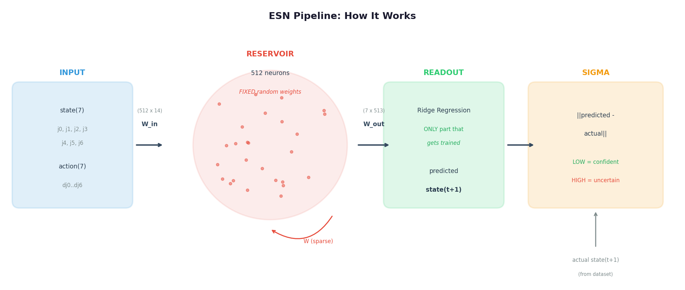
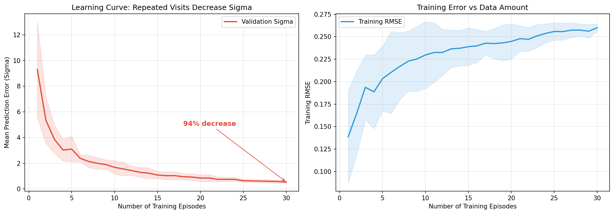

# omni3 — ESN Uncertainty Estimator for Robotic Arm Manipulation

**Echo State Network prediction error as a real-time uncertainty signal for detecting manipulation failures.**

Train on successful demonstrations. Detect failures via prediction error (sigma). No GPU required — trains in under 2 seconds on CPU.



---

## Key Results

| Finding | Result |
|---------|--------|
| Learning curve | **94% sigma decrease** over 30 episodes — ESN builds a generative model |
| Failure detection | **1.54x** higher sigma in failed vs successful episodes |
| Classification | **AUC = 0.785** using sigma alone |
| Early warning | Sigma diverges at **27% completion** — 73% warning time |
| Most predictive joint | joint_2 (upper arm) at **2.64x** failure/success ratio |
| Training time | **< 1 second** (closed-form ridge regression, no gradient descent) |



*Validation sigma drops 94% as the ESN sees more episodes of the same task — proving it builds a generative model.*

---

## How It Works

1. **Input**: Robot's joint state (7) + action command (7) = 14 dimensions
2. **ESN Reservoir**: 512 randomly connected neurons process the input, maintaining temporal memory (weights are **fixed**, never trained)
3. **Readout**: A linear layer predicts the next joint state via ridge regression (**only trained part**)
4. **Sigma**: `||predicted - actual|| = uncertainty`. Low = familiar. High = unexpected.

The ESN learns what "normal" robot behavior looks like. When it encounters a failure, its predictions become less accurate — sigma goes up.

---

## Quick Start

```bash
# Prerequisites: Python 3.10, pip
pip install -r omni3/requirements.txt

# Run the full task-specific analysis (downloads data automatically)
python3.10 omni3/scripts/08_task_specific.py

# View results
xdg-open omni3/output/task_specific/learning_curve.png
xdg-open omni3/output/task_specific/task5_per_joint_comparison.png
xdg-open omni3/output/task_specific/task5_roc_curve.png
```

---

## Full Pipeline (Run in Order)

| Step | Script | What It Does | Time |
|------|--------|-------------|------|
| 0 | `00_explore.py` | Inspect dataset (episodes, state dims, tasks) | ~7s |
| 1 | `01_filter.py` | Detect anomalies (velocity spikes, acceleration) | ~9s |
| 2 | `02_train_esn.py` | Train ESN readout on UR5 data | ~1s |
| 3 | `03_validate.py` | Check if sigma spikes before anomalies | ~3s |
| 4 | `04_visualize.py` | Interactive Rerun.io visualization | ~6s |
| 5 | `06_droid_failures.py` | DROID-100: success vs failure analysis | ~12s |
| 6 | `07_phase1_analysis.py` | Per-joint, temporal, ROC classification | ~15s |
| 7 | `08_task_specific.py` | Task-specific analysis + learning curve | ~25s |

```bash
# Example: run everything
python3.10 omni3/scripts/00_explore.py --episodes 50
python3.10 omni3/scripts/01_filter.py --episodes 100
python3.10 omni3/scripts/02_train_esn.py --train-episodes 100
python3.10 omni3/scripts/03_validate.py
python3.10 omni3/scripts/04_visualize.py --episodes 0 1 2 --save-rrd omni3/output/viz.rrd
python3.10 omni3/scripts/06_droid_failures.py
python3.10 omni3/scripts/07_phase1_analysis.py
python3.10 omni3/scripts/08_task_specific.py
```

---

## Datasets

| Dataset | Robot | Episodes | Success/Fail | State | Link |
|---------|-------|----------|-------------|-------|------|
| `lerobot/berkeley_autolab_ur5` | UR5 6-DOF | 1,000 | 1000/0 | 8 (EE pose + gripper) | [HuggingFace](https://huggingface.co/datasets/lerobot/berkeley_autolab_ur5) |
| `lerobot/droid_100` | Franka 7-DOF | 100 | 81/19 | 7 (joint positions) | [HuggingFace](https://huggingface.co/datasets/lerobot/droid_100) |

Datasets download automatically from HuggingFace on first run. Cached in `~/.cache/huggingface/`.

---

## Project Structure

```
omni3/
├── config.py                    # All parameters (ESN, thresholds, paths)
├── requirements.txt             # Python 3.10 dependencies
│
├── data/
│   ├── loader.py                # UR5 dataset loader (LeRobot)
│   └── droid_loader.py          # DROID-100 loader + task filtering
│
├── core/
│   ├── esn.py                   # Echo State Network (512 neurons, FIXED weights)
│   ├── readout.py               # Ridge regression readout (ONLY trained part)
│   └── uncertainty.py           # Sigma computation + caution/curiosity zones
│
├── analysis/
│   ├── filter.py                # Anomaly detection (4 types)
│   ├── phase1.py                # Per-joint, temporal, ROC classification
│   └── task_analysis.py         # Incremental learning curve
│
├── viz/
│   ├── rerun_logger.py          # Rerun.io interactive visualization
│   └── blueprint.py             # Rerun viewer layout
│
├── pipeline.py                  # Orchestrator: train + evaluate
│
├── scripts/                     # Numbered scripts — run in order
│   ├── 00_explore.py
│   ├── 01_filter.py
│   ├── 02_train_esn.py
│   ├── 03_validate.py
│   ├── 04_visualize.py
│   ├── 06_droid_failures.py
│   ├── 07_phase1_analysis.py
│   ├── 08_task_specific.py
│   ├── generate_report.py
│   ├── generate_task_report.py
│   └── generate_guide.py
│
└── output/                      # Generated results (gitignored except reports)
    ├── models/                  # Trained ESN readout weights
    ├── phase1/                  # Phase 1 analysis plots
    ├── task_specific/           # Task-specific analysis plots
    ├── validation/              # Sigma timelines per episode
    └── reports/                 # PDF reports
```

---

## ESN Parameters

| Parameter | Default | Description |
|-----------|---------|-------------|
| `RESERVOIR_SIZE` | 512 | Number of reservoir neurons |
| `SPECTRAL_RADIUS` | 0.95 | Memory length (higher = longer memory) |
| `LEAKING_RATE` | 0.3 | State decay rate (0 = keep all, 1 = forget all) |
| `INPUT_SCALING` | 0.3 | Input weight scale |
| `RIDGE_ALPHA` | 0.01 | Regularization strength |
| `ESN_WARMUP_STEPS` | 10 | Frames to discard (transient) |

All parameters are in `config.py`. Start with defaults — only tune if results are poor.

---

## Adapting for a New Dataset

1. **Find a LeRobot dataset** on [HuggingFace](https://huggingface.co/datasets?search=lerobot)
2. **Inspect it**: `python3.10 -c "from lerobot.datasets.lerobot_dataset import LeRobotDataset; ds = LeRobotDataset('YOUR_REPO'); print(ds.features.keys())"`
3. **Update `config.py`**: Set `DATASET_REPO_ID`, `STATE_DIM`, `ACTION_DIM`, `STATE_NAMES`, `ACTION_NAMES`
4. **Run the pipeline**: Scripts 00-04 work with any LeRobot dataset

The ESN core (`core/esn.py`, `core/readout.py`, `core/uncertainty.py`) is fully dataset-agnostic.

---

## Visualization

### Rerun.io (Interactive Timeline)

```bash
# Generate recording
python3.10 omni3/scripts/04_visualize.py --episodes 0 1 2 --save-rrd omni3/output/viz.rrd

# Open viewer
rerun omni3/output/viz.rrd
```

Shows: 3D EE trajectory, joint time series, sigma timeline, anomaly markers, per-joint prediction error.

### Matplotlib (Static Plots)

Generated automatically by analysis scripts into `output/phase1/` and `output/task_specific/`.

---

## Reports (PDF)

| Report | Script | Description |
|--------|--------|-------------|
| Phase 0 + 1 Report | `generate_report.py` | Original findings for boss |
| Task-Specific Findings | `generate_task_report.py` | Task 5 analysis + BCM theory |
| Replication Guide | `generate_guide.py` | Teammate setup guide (11 pages) |

```bash
python3.10 omni3/scripts/generate_report.py
python3.10 omni3/scripts/generate_task_report.py
python3.10 omni3/scripts/generate_guide.py
```

---

## Next Steps

- **BCM Learning**: Adapt reservoir weights online using Bienenstock-Cooper-Munro plasticity rule
- **Curious Pi**: When sigma is high, perform exploratory actions to reduce uncertainty
- **Cautious Pi**: When sigma is high, slow down and increase control gains
- **Scale**: Train on full DROID (95K episodes) or KUKA (209K episodes)
- **Real Robot**: Deploy sigma as a real-time safety layer on physical UR5/Franka

---

## Requirements

- Python 3.10 (LeRobot dependency)
- No GPU required
- ~4 GB RAM, ~2 GB disk
- Linux (tested Ubuntu 22.04) or macOS

```bash
pip install -r omni3/requirements.txt
```

---

## References

- [Echo State Networks (Jaeger, 2001)](https://www.sciencedirect.com/science/article/pii/S0893608007000457)
- [LeRobot (HuggingFace)](https://github.com/huggingface/lerobot)
- [DROID Dataset](https://droid-dataset.github.io/)
- [Berkeley Autolab UR5](https://huggingface.co/datasets/lerobot/berkeley_autolab_ur5)
- [Rerun.io](https://rerun.io/)
- [BCM Theory (Wikipedia)](https://en.wikipedia.org/wiki/BCM_theory)

---

**OMNIBIO LTD** | April 2026
